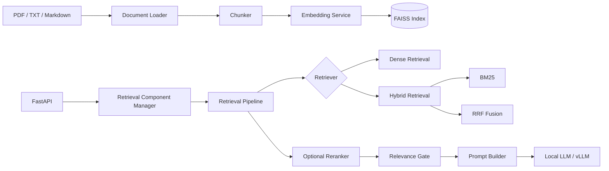

# Runtime-Switchable Local RAG Service

A local Retrieval-Augmented Generation service built from scratch with FastAPI, FAISS, BM25, BGE-M3, and vLLM.

The project implements the complete RAG lifecycle, including document ingestion, incremental indexing, dense and hybrid retrieval, relevance gating, source attribution, persistent index recovery, and grounded answer generation. Instead of relying on a high-level RAG framework, the retrieval, reranking, indexing, and runtime composition layers are implemented explicitly.

A key feature is runtime-switchable retrieval. The service can switch between dense retrieval and hybrid retrieval using BM25 with Reciprocal Rank Fusion without restarting the service or re-embedding documents. Retrieval components are replaced atomically, allowing active requests to continue using a consistent pipeline snapshot while new requests use the updated configuration.

## Highlights

* PDF, TXT, and Markdown ingestion
* Incremental FAISS indexing and persistent document manifest
* Dense retrieval using BGE-M3 embeddings
* Hybrid retrieval using Dense, BM25, and Reciprocal Rank Fusion
* Optional cross-encoder reranking
* Online retrieval-pipeline switching through REST API
* Atomic component replacement and request-level snapshots
* Relevance gating before LLM generation
* Source, page, score, and latency reporting
* Automatic index loading or rebuilding during startup
* Docker Compose deployment with local vLLM inference
